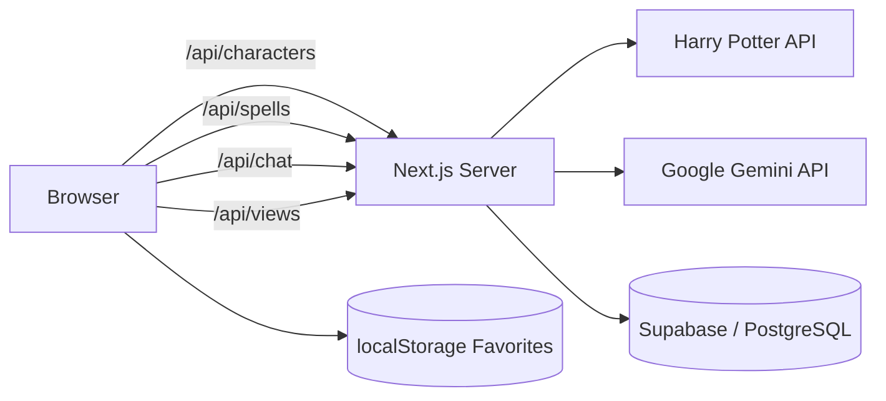

# Harry Potter Explorer

A full-stack Harry Potter universe explorer built for the **nFactorial AI Engineering scholarship challenge**. Users can explore Hogwarts houses, search and paginate characters, inspect detailed profiles, browse spells and magical artifacts, save favorites, see live popularity data, and chat with fictional characters through Gemini AI.

> **Disclaimer:** This is an unofficial fan-made educational project. It is not affiliated with J.K. Rowling, Warner Bros., or the Harry Potter franchise.

## Live demo

**Production:** https://harry-potter-explorer-chatgpt-gn9p4eeqr-shokan.vercel.app  
**GitHub:** https://github.com/shokanm/harry-potter-explorer-ChatGPT

## Requirements coverage

### Level 1 — Basic interface

- Atmospheric Hogwarts-inspired home page with navigation
- Dedicated Houses page
- Gryffindor, Slytherin, Ravenclaw and Hufflepuff cards
- House colors, symbolism, traits and descriptions

### Level 2 — Dynamic data and search

- Character data from the Harry Potter API
- **All Harry Potter API requests are made server-side**
- Character image, name, house and patronus
- Search by character name
- House filtering
- Server-side pagination
- Loading, empty and error states

### Level 3 — Public access

- Public GitHub repository
- Production deployment on Vercel
- Production build support with `npm run build`

### Bonus features

- Character detail page with date of birth, species, ancestry, wand, patronus, actor and Hogwarts role
- Favorites persisted in `localStorage`
- Supabase/PostgreSQL-backed character popularity statistics
- Atomic database increments through a PostgreSQL RPC
- Near-real-time leaderboard refresh every 8 seconds through `/api/views`
- AI character chat powered by **Google Gemini 3.6 Flash**
- Magical artifacts explorer
- Graceful fallback when optional database or AI secrets are not configured

## Architecture



The browser never calls the Harry Potter API, Gemini API, or Supabase directly. Every external service is accessed through application-owned Next.js route handlers. This directly satisfies the challenge requirement that **external APIs and services must be called from the server side**.

## Tech stack

- **Next.js 15 + App Router** — frontend and backend in one deployable application; Route Handlers create a clean server-only integration boundary.
- **React + TypeScript** — typed models and reusable UI components reduce errors when dealing with third-party API data.
- **Plain CSS design system** — keeps the project lightweight while allowing a custom Hogwarts-inspired visual identity.
- **Lucide React** — lightweight, consistent iconography.
- **Supabase / PostgreSQL** — stores aggregate character-view statistics.
- **Google Gemini 3.6 Flash** — powers role-play conversations while the API key remains server-side.
- **Vercel** — production hosting with first-class support for Next.js server functions.

## Why this stack

The challenge requires third-party services to be called from the server. A separate SPA plus separate backend would work, but it would add deployment, CORS and repository complexity without improving the core experience.

Next.js keeps the UI and backend boundary inside one TypeScript codebase while still providing a real server integration layer. Authentication was intentionally excluded because favorites are device-local and popularity data is aggregate-only; adding login/JWT/account-management flows would increase complexity without improving the requested experience.

## Getting started

### 1. Clone

```bash
git clone https://github.com/shokanm/harry-potter-explorer-ChatGPT.git
cd harry-potter-explorer-ChatGPT
```

### 2. Use Node.js 20+

```bash
nvm install 20
nvm use 20
```

### 3. Install dependencies

```bash
npm install
```

### 4. Configure environment variables

```bash
cp .env.example .env.local
```

The core explorer works without secrets. Supabase analytics and Gemini chat are optional enhancements.

### 5. Run locally

```bash
npm run dev
```

Open `http://localhost:3000`.

### 6. Production check

```bash
npm run build
npm start
```

## Environment variables

```env
GEMINI_API_KEY=
GEMINI_MODEL=gemini-3.6-flash

SUPABASE_URL=
SUPABASE_SECRET_KEY=
```

| Variable | Required | Purpose |
|---|---:|---|
| `GEMINI_API_KEY` | No | Enables live AI character chat |
| `GEMINI_MODEL` | No | Gemini model name; currently `gemini-3.6-flash` |
| `SUPABASE_URL` | No | Supabase project URL |
| `SUPABASE_SECRET_KEY` | No | Server-only Supabase credential |

**Never** expose `GEMINI_API_KEY` or `SUPABASE_SECRET_KEY` with a `NEXT_PUBLIC_` prefix, and never commit `.env.local`.

## Supabase setup

Run `supabase.sql` in the Supabase SQL Editor, then set `SUPABASE_URL` and `SUPABASE_SECRET_KEY` locally and in Vercel.

Opening a character detail page sends `POST /api/views`. The server calls the PostgreSQL `increment_character_view` RPC, which uses an atomic `UPSERT` (`views = views + 1`) so concurrent profile opens do not lose increments.

The home-page **Most Explored Wizards** component requests `GET /api/views` every 8 seconds. This gives reviewers near-real-time database feedback while preserving the rule that the browser never talks directly to Supabase.

## AI character chat

The AI chat uses Google Gemini through the server-side `/api/chat` route.

Each request includes a character-specific system instruction and recent conversation history. This creates a more recognizable persona and allows the conversation to maintain context across messages.

```text
Browser
  ↓ POST /api/chat
Next.js Route Handler
  ↓ server-side request
Google Gemini API
  ↓
Next.js
  ↓
Browser
```

The Gemini API key is never sent to the client.

## Magical artifacts

The `/artifacts` page adds a curated lore collection for iconic magical objects such as the Elder Wand, Invisibility Cloak, Resurrection Stone, Marauder's Map, Time-Turner, Sorting Hat, Sword of Gryffindor and Philosopher's Stone.

This data is intentionally local because the required Harry Potter API does not provide an artifacts endpoint. No unnecessary external service is introduced just to supply static lore content.

## Design and development process

1. **Requirement mapping** — every competition requirement was translated into either a visible feature or an explicit architecture constraint.
2. **Server boundary first** — third-party integrations were placed behind Next.js Route Handlers before client data flows were built.
3. **Progressive enhancement** — core exploration works without secrets; database analytics and AI chat enhance the app rather than block it.
4. **Reusable domain components** — character cards, house cards, favorites helpers and typed models are shared between screens.
5. **Failure-aware UX** — upstream failures produce readable fallback states rather than blank pages or exposed stack traces.
6. **Contest-focused scope** — authentication and unrelated admin tooling were excluded so effort could go into architecture, data flow, AI and polish.
7. **Production-first validation** — the project is built for production and deployed publicly instead of being demonstrated only locally.

## Unique approaches

### Server-side pagination over a non-paginated API

The Harry Potter API returns the character collection without the pagination behavior required by the UI. `/api/characters` performs upstream fetching, search, house filtering and pagination on the server, returning only the requested page to the browser.

### Server-only integration boundary

The frontend communicates only with this application's `/api/*` endpoints. Provider-specific logic and secret credentials stay outside the client bundle.

### Atomic popularity counter

Character views are incremented using a PostgreSQL `UPSERT` RPC rather than a read-modify-write sequence. This avoids lost updates when multiple users open the same character concurrently.

### Near-real-time popularity without exposing Supabase

The leaderboard refreshes every 8 seconds by polling `/api/views`. Database changes become visible automatically, while Supabase remains fully hidden behind the server boundary.

### Local-first favorites

Favorites are a small, non-sensitive preference, so `localStorage` is intentionally used instead of requiring registration and database writes.

### Character-specific LLM role-play

The chat is not a generic bot with a Harry Potter skin. The server builds character-specific system instructions and sends recent conversation history for stronger persona consistency.

## Trade-offs

- **Next.js monolith vs separate backend:** simpler deployment and review surface; a dedicated backend could scale independently but is unnecessary for this challenge.
- **Server-side filtering/pagination:** appropriate for the HP API's current dataset, but fetching the whole upstream collection would not scale to millions of records.
- **`localStorage` favorites:** simple and zero-auth, but favorites do not synchronize across devices.
- **Aggregate popularity only:** avoids collecting unnecessary per-user analytics.
- **8-second polling vs WebSockets:** preserves the server-only integration rule and is easy to review, at the cost of a small delay and periodic requests.
- **No authentication:** keeps focus on challenge requirements instead of account-management flows.
- **Non-streaming AI responses:** simpler implementation, but users wait for the complete model response before it appears.
- **LLM role-play:** prompts improve consistency, but generated responses can occasionally diverge from canon.

## Known issues / limitations

- Some HP API characters have no portrait, patronus, house, wand information or birth date; the UI displays fallbacks.
- The upstream HP API can occasionally respond slowly during cold starts.
- Favorites are browser/device-specific.
- AI responses can occasionally contain non-canon details or imperfect character voice.
- Gemini chat depends on provider model availability and free-tier quota.
- Popularity is near-real-time polling, not a WebSocket subscription.
- Artifact descriptions are curated local content because the required HP API has no artifacts endpoint.

## Security notes

- External integrations are server-side only.
- Secrets are read only from server environment variables.
- `.env*` secret files are excluded from Git.
- No secret uses a `NEXT_PUBLIC_` prefix.
- Supabase credentials never reach the browser.
- Gemini requests are proxied through `/api/chat`.
- Database writes use a restricted RPC instead of client-side table access.
- API errors are normalized before reaching the UI.

## Deployment — Vercel

1. Push the project to a public GitHub repository.
2. Import it into Vercel.
3. Add optional environment variables under **Project Settings → Environment Variables**.
4. Deploy or redeploy after changing environment variables.
5. Verify:

```text
/
/houses
/characters
/spells
/artifacts
/favorites
/chat
/api/views
```

## Project structure

```text
app/
  api/
    characters/
    chat/
    spells/
    views/
  artifacts/
  characters/
  chat/
  favorites/
  houses/
  spells/
components/
lib/
types/
supabase.sql
.env.example
README.md
```

## Future improvements

- Streaming Gemini responses
- More character-specific personas
- URL-synchronized search/filter state
- End-to-end tests with Playwright
- Better caching/retry strategy for HP API failures
- Optional WebSocket/Reatime bridge for instant leaderboard updates
- Cross-device favorite synchronization if authentication is introduced

## Submission checklist

- [x] Public GitHub repository
- [x] README with description, setup and run instructions
- [x] Design/development process documented
- [x] Unique approaches documented
- [x] Trade-offs documented
- [x] Known issues documented
- [x] Technical stack choice explained
- [x] Harry Potter API called server-side
- [x] Character search and pagination
- [x] Public production deployment
- [x] Character details
- [x] Local favorites
- [x] Supabase/PostgreSQL integration
- [x] Near-real-time popularity refresh
- [x] LLM character chat
- [x] Magical artifacts collection

---

Built as a focused full-stack submission for the **nFactorial AI Engineering challenge**.
