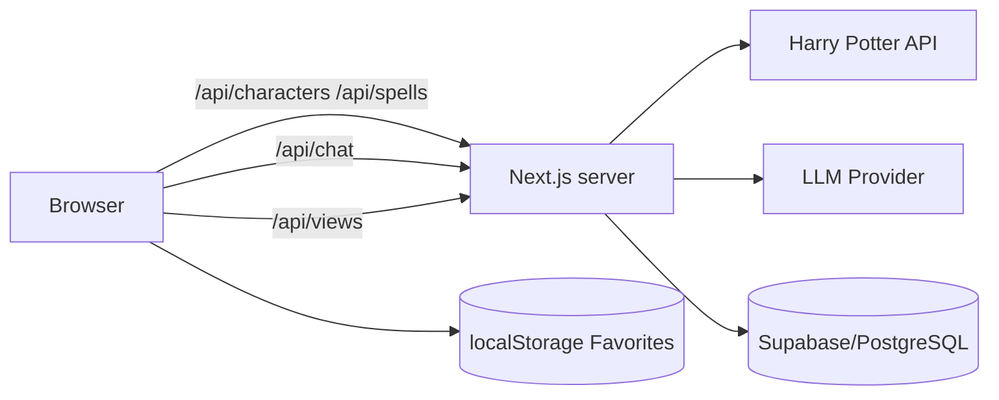

# Harry Potter Explorer

A full-stack, competition-ready Harry Potter universe explorer built for the nFactorial AI Engineering scholarship challenge. Users can discover Hogwarts houses, search and paginate characters, inspect detailed profiles, browse spells, save favorites locally, view live popularity stats, and chat with fictional characters through an optional LLM integration.

> **Disclaimer:** This is an unofficial fan-made educational project. It is not affiliated with J.K. Rowling, Warner Bros., or the Harry Potter franchise.

## Demo

Deploy the project to Vercel (recommended) and place the public URL here:

`https://YOUR-PROJECT.vercel.app`

## Requirements coverage

### Level 1 — Basic interface

- Atmospheric home page with navigation
- Dedicated Hogwarts Houses page
- Gryffindor, Slytherin, Ravenclaw and Hufflepuff cards
- House colors, symbolism, traits and descriptions

### Level 2 — Dynamic data and search

- Character data from the Harry Potter API
- **External HP API is called only from the server**
- Character image, name, house and patronus
- Search by character name
- House filtering
- Server-side pagination
- Loading, empty and error states

### Level 3 — Public access

- Optimized for deployment on Vercel
- Production build script included

### Bonus

- Character detail page with DOB, species, ancestry, wand, patronus, actor, status and Hogwarts role
- Favorites persisted in `localStorage`
- Optional Supabase/PostgreSQL character-view leaderboard
- Optional OpenAI-compatible LLM character chat
- Graceful fallback when database or LLM secrets are not configured

## Architecture



The browser never calls the HP API, the LLM provider, or Supabase directly. All external services are behind application-owned server endpoints.

## Tech stack

- **Next.js + App Router** — frontend and backend in one deployable project. Route Handlers are a natural way to enforce the contest requirement that external services must be called from the server.
- **React + TypeScript** — typed models improve safety when dealing with inconsistent third-party API data.
- **Plain CSS design system** — keeps the project lightweight while still allowing a bespoke Hogwarts-inspired interface instead of a generic component-library look.
- **Lucide React** — small, consistent icon set.
- **Supabase/PostgreSQL (optional)** — simple hosted database for live character-view statistics.
- **OpenAI-compatible API (optional)** — powers role-play conversations while keeping secrets server-side.
- **Vercel** — first-class Next.js deployment and server function support.

## Why this stack

The challenge specifically requires server-side access to third-party services. A split SPA + separate backend would work, but it adds repository, deployment and CORS complexity for little contest value. Next.js keeps presentation and API boundaries in one TypeScript codebase while still providing a real server integration layer.

The project intentionally avoids authentication. Favorites are device-local and the live database feature is aggregate-only, so login would add significant implementation and review complexity without improving the required experience.

## Getting started

### 1. Clone the repository

```bash
git clone https://github.com/YOUR_USERNAME/harry-potter-explorer.git
cd harry-potter-explorer
```

### 2. Install dependencies

```bash
npm install
```

### 3. Configure environment variables

```bash
cp .env.example .env.local
```

The core application works without any secret variables. HP API access does not require a key.

### 4. Run locally

```bash
npm run dev
```

Open `http://localhost:3000`.

### 5. Production check

```bash
npm run build
npm start
```

## Environment variables

| Variable | Required | Purpose |
|---|---:|---|
| `OPENAI_API_KEY` | No | Enables live AI character chat |
| `OPENAI_MODEL` | No | LLM model, defaults to `gpt-4o-mini` |
| `SUPABASE_URL` | No | Supabase project URL for view statistics |
| `SUPABASE_SERVICE_ROLE_KEY` | No | Server-only database credential |

**Never expose `SUPABASE_SERVICE_ROLE_KEY` or `OPENAI_API_KEY` with a `NEXT_PUBLIC_` prefix.**

## Database setup

1. Create a Supabase project.
2. Run `supabase.sql` in the SQL editor.
3. Add `SUPABASE_URL` and `SUPABASE_SERVICE_ROLE_KEY` to `.env.local` and your deployment secrets.
4. Restart the application.

Character detail opens then increment the aggregate view counter through `/api/views`. The client never receives the service-role credential.

## Design and development process

1. **Requirement mapping.** Each contest requirement was converted into a visible feature or explicit architecture constraint.
2. **Server boundary first.** Third-party integrations were designed behind route handlers before UI data fetching was implemented.
3. **Progressive enhancement.** Core HP exploration works with zero secrets. Database and AI features enhance the app rather than block it.
4. **Reusable domain components.** Character cards, house cards, favorites helpers and typed domain models are shared across screens.
5. **Failure-aware UX.** Third-party service failures result in readable UI states instead of blank pages or exposed stack traces.
6. **Contest-focused scope.** Authentication and unrelated admin tooling were excluded so time could be invested in data flow, polish and AI functionality.

## Unique approaches

### Server-side pagination over a non-paginated API

The Harry Potter API returns the full character collection. Rather than sending the entire dataset to the browser, `/api/characters` fetches/caches the upstream data server-side, applies search and house filters, and returns only the requested page.

### Optional integrations without broken demos

A reviewer can clone and run the app without owning OpenAI or Supabase credentials. Missing optional integrations degrade gracefully and explain how to enable them.

### Privacy and secret containment

All service credentials and external calls are kept server-side. The browser only communicates with this application's own `/api/*` routes.

### Local-first favorites

Favorites are a personal, non-sensitive preference. `localStorage` is intentionally used instead of requiring user registration and a database write for a feature that does not need cross-device identity.

## Trade-offs

- **Next.js monolith vs separate backend:** Chosen for simpler deployment and a smaller review surface. A dedicated backend could scale independently but is unnecessary here.
- **Server-side filtering/pagination:** The upstream HP API does not provide robust pagination, so the server fetches the collection and slices results. The response is cached to reduce upstream traffic, but this would not be ideal for a very large dataset.
- **localStorage favorites:** Fast and zero-auth, but favorites do not sync across devices.
- **Aggregate view counter:** The demo implementation is deliberately simple. Under very high concurrent traffic, a database RPC/atomic increment would be preferable to read-then-update.
- **No authentication:** Keeps attention on the actual challenge and avoids unnecessary security/account flows.
- **LLM role-play:** A concise system prompt creates a recognizable voice, but LLM output can still occasionally diverge from canon.

## Known issues / limitations

- Some HP API characters have no portrait, patronus, house, wand details or birth date; the UI displays sensible fallbacks.
- The upstream API can be slow during cold starts on its hosting provider.
- Favorites are browser/device-specific.
- AI chat requires a valid LLM API key and may incur provider costs.
- Character popularity writes use a simple non-atomic increment; for production-scale traffic, replace this with a PostgreSQL function using `views = views + 1` atomically.
- The project intentionally avoids official movie artwork and franchise branding assets beyond images supplied by the data API.

## Deployment — Vercel

1. Push this project to a **public GitHub repository**.
2. In Vercel, choose **Add New → Project**.
3. Import the GitHub repository.
4. Add optional environment variables under **Project Settings → Environment Variables**.
5. Deploy.
6. Test these routes on the public deployment:
   - `/`
   - `/houses`
   - `/characters`
   - `/spells`
   - `/favorites`
   - `/chat`
7. Put the production URL into the `Demo` section of this README.

## Security notes

- External integrations are server-side only.
- Secrets are read only from server environment variables.
- `.env*` is excluded from Git.
- No secret is prefixed with `NEXT_PUBLIC_`.
- API errors are normalized before reaching the client.

## Project structure

```text
app/
  api/
    characters/
    chat/
    spells/
    views/
  characters/
  chat/
  favorites/
  houses/
  spells/
components/
lib/
types/
supabase.sql
.env.example
README.md
```

## Future improvements

- Atomic PostgreSQL RPC for view counters
- Streaming AI responses
- More characters/personas in AI Chat
- URL-synced search/filter state
- End-to-end tests with Playwright
- Offline-friendly caching for favorites and recently viewed characters
